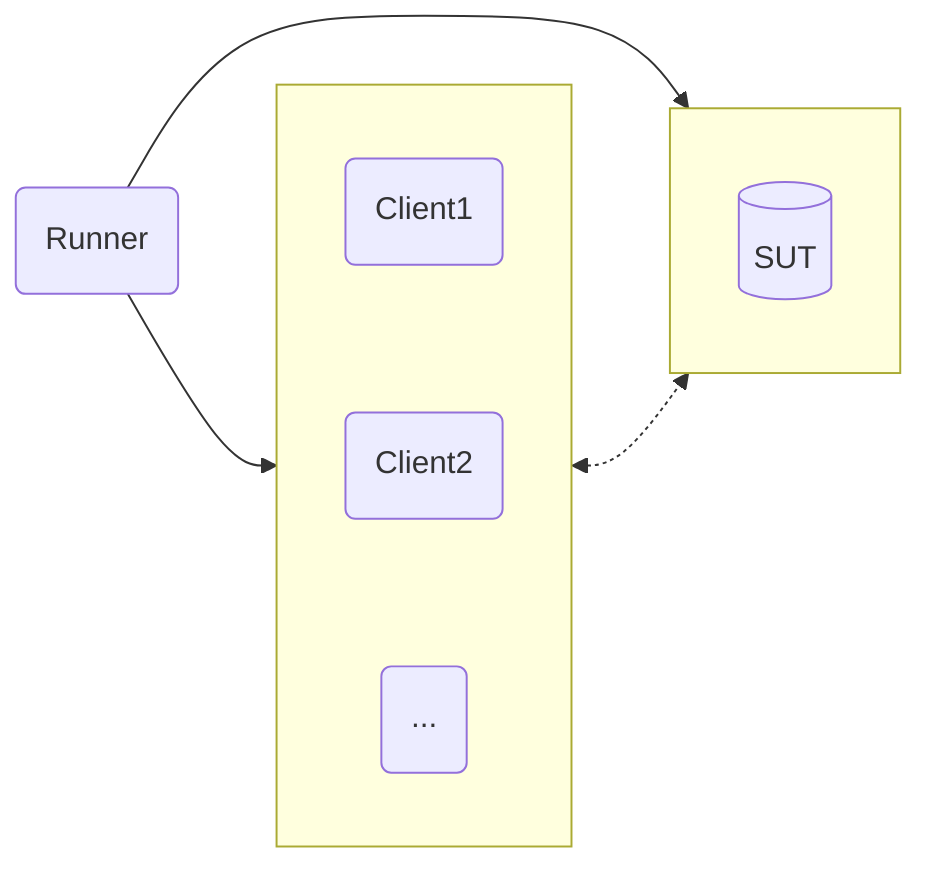

# Ampere Perfkit Benchmarker

Ampere Perfkit Benchmarker (APB) is a fork of PerfKitBenchmarker from GCP: https://github.com/GoogleCloudPlatform/PerfKitBenchmarker

- APB Version: 2.4.0
- Upstream PerfKitBenchmarker commit SHA: 3a8ae41e2c162829d628f9d59ce4aa2060e0b236

APB is an automated performance benchmarking suite that can provision/teardown cloud infrastructure, build applications, run benchmarks, and capture all workload parameters and tunings for a given SUT in a single, replayable `.yaml` configuration file.

- See [CHANGELOG](CHANGELOG.md) for an exhaustive list of changes, bugfixes, and features
- See [Guides](ampere/pkb/docs/guides) for various guides, tips, and tricks
- See [Contribution Guide](ampere/pkb/docs/CONTRIBUTING.md) for issues, feature requests, and questions 

# Licensing

Ampere Perfkit Benchmarker provides wrappers and workload definitions around popular
benchmark tools. We made it very simple to use and automate everything we can.
It instantiates VMs on the Cloud provider of your choice, automatically installs
benchmarks, and runs the workloads without user interaction.

Due to the level of automation you will not see prompts for software installed
as part of a benchmark run. Therefore you must accept the license of each of the
benchmarks individually, and take responsibility for using them before you use
the Ampere Perfkit Benchmarker. 

In its current release these are the benchmarks that are executed and their associated license terms:

- `cassandra`: [Apache v2](https://github.com/apache/cassandra/blob/trunk/LICENSE.txt)
- `tlp-stress`: [Apache v2](https://github.com/thelastpickle/tlp-stress/blob/master/LICENSE.txt)
- `ffmpeg`: [LGPL with optional components licensed under GPL](https://github.com/FFmpeg/FFmpeg/blob/master/LICENSE.md)
- `memtier_benchmark`: [GPL v2](https://github.com/RedisLabs/memtier_benchmark?tab=GPL-2.0-1-ov-file)
- `mysql`: [GPL v2](https://github.com/mysql/mysql-server/blob/trunk/LICENSE)
- `nginx`: [BSD-2-Clause](https://github.com/nginx/nginx/blob/master/LICENSE)
- `openssl`: [Apache v2](https://github.com/openssl/openssl/blob/master/LICENSE.txt)
- `redis`: Dual-licensing model with [RSALv2 and SSPLv1](https://github.com/redis/redis/blob/unstable/LICENSE.txt)
- `sysbench`: [GPL v2](https://github.com/akopytov/sysbench?tab=GPL-2.0-1-ov-file#readme)
- `wrk`: [Apache v2](https://github.com/wg/wrk/blob/master/LICENSE)
- `multichase`: [Apache v2](https://github.com/google/multichase/blob/master/LICENSE)

# APB: Overview, Setup, and Usage

## Overview

APB runs on a separate system from the system-under-test (SUT), and sends commands over SSH to the SUT to perform benchmarks.

The steps in this guide will help to prepare a new APB runner system.

### Test Topology

A minimum of 2+ systems is required for APB. 

The simplest configuration would consist of one runner system and one system-under-test (SUT) for single-node tests. 

A more involved configuration might consist of one runner system, one SUT, and one or more clients (depending on the workload).



## Dependencies

The APB Runner system requires 
- Python >=3.11
  - *NOTE*: Python versions >=3.13 may work with APB, however compatibility is not guaranteed and behavior may vary.
- `pip` for package management
- A virtual environment for dependencies

## Setup APB

Use the setup script
```bash
source setup.sh
```

The setup script will
- Detect if Python >=3.11.x is installed
- Create a virtual environment
- Install all dependencies for APB
- Start the virtual environment

Alternatively, setup APB manually, e.g.
```bash
$ sudo dnf install python3.12
$ python3.12 -m venv venv
$ source venv/bin/activate
$ python3.12 -m pip install --upgrade pip
$ pip install -r requirements.txt
```

## Prerequisites

- Setup passwordless SSH from the Runner -> SUT/Client(s)
  - Reference(s): see the [SSH Academy Guide](https://www.ssh.com/academy/ssh/copy-id)
  - Example path to private key on the Runner: `/home/apb_runner/.ssh/apb_key`
- Setup passwordless sudo for the user associated with the SSH key on the SUT/Client(s)
  - Reference(s): see the answer to this post on [Server Fault](https://serverfault.com/questions/160581/how-to-setup-passwordless-sudo-on-linux)
  - Example user: `apb_user`
- The external IP address of the SUT
  - Example IP address: `192.0.2.0`

Example header block for a valid `.yaml` configuration after following the steps above
```yaml
static_vms:
  - &server
    ip_address: 192.0.2.0
    user_name: apb_user
    ssh_private_key: /home/apb_runner/.ssh/apb_key
    os_type: fedora42
```

For more examples see the APB [example configurations](ampere/pkb/configs)

## Usage

### The 5 Stages of a PerfKitBenchmarker run


To initiate all phases, simply call APB with the workload and config of your choice.

Run from the root of the project directory and be sure the virtual environment is active.

```bash
./pkb.py --benchmarks=<benchmark_name> --benchmark_config_file=<path_to_config>
```

e.g. to run NGINX and wrk with an existing YAML config
```bash
./pkb.py --benchmarks=ampere_nginx_wrk --benchmark_config_file=./ampere/pkb/configs/example_nginx.yml
```

- Each YAML config file represents a workload configuration for a certain system(s) and environment
- The path to the configuration file in the run command can be relative or absolute
- The benchmark name must match the name defined in the YAML config
- For more details about setting up a BareMetal run, see the [BareMetal Getting Started Guide](ampere/pkb/docs/guides/baremetal-getting-started.md)
- For more details about setting up cloud-based runs on OCI, see the [OCI Getting Started Guide](ampere/pkb/docs/guides/oci-getting-started.md)

### A few useful PerfKitBenchmarker flags

| Flag | Description |
| ---- | ----------- |
| `--run_stage_iterations=<n>` | Execute the run stage N times in a row |
| `--run_stage=<provision,prepare,run,cleanup,teardown>` | Run in stages, useful for monitoring/debugging between runs |
|`--helpmatch=ampere`|Searches and matches any flag that has been implemented by Ampere with a description on how to use it. You can use the `.` notation to drill down in to specific flags you're interested in. E.G. `./pkb.py --helpmatch=ampere.pkb.linux_packages.redis` will return all the associated `ampere_redis_server` flags for running `ampere_redis_memtier`|

Usage example:
1. Pass `--run_stage=provision,prepare`
2. Save the `run_uri` generated at the end of this first pass
3. Connect to SUT for debugging/monitoring
4. Pass `--run_stage=run --run_uri=<run_uri>` to repeat testing manually N times
5. Pass `--run_stage=cleanup,teardown --run_uri<run_uri>` when ready to finish

## Results

After an APB run completes the Python virtual environment can be deactivated
```bash
deactivate
```

For results, see
- `/tmp/perfkitbenchmarker/runs/<run_uri>`
  - Parent directory for all test results, logs, etc.
  - This directory (with the correct run_uri) will be printed to stdout at the end of each test run 
- `/tmp/perfkitbenchmarker/runs/<run_uri>/perfkitbenchmarker_results.json`
  - Exhaustive benchmark results and metadata
